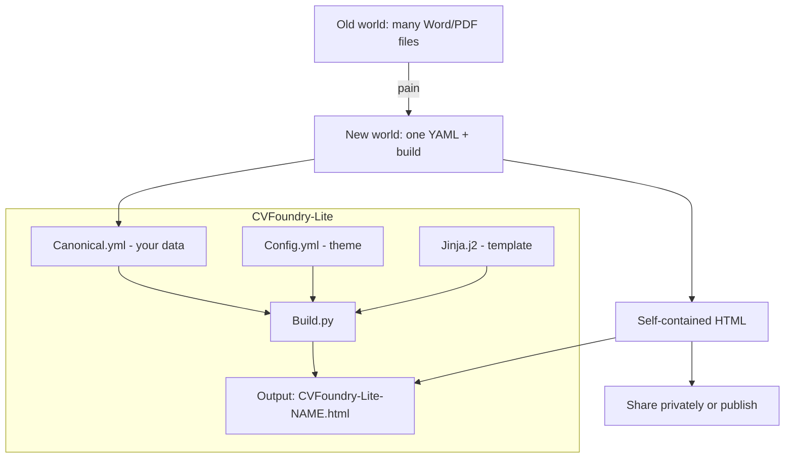
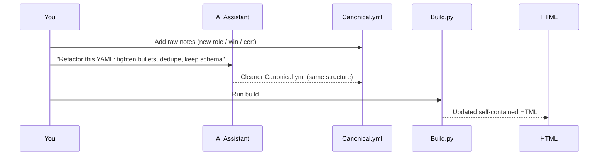

# CVFoundry-Lite — How-To (AI Co-Collaboration)

This guide is for **moderately technical** newcomers who want a better way to manage and publish a resume than manually editing and archiving Word/PDF files.

CVFoundry-Lite gives you:
- A single “source of truth” resume file: `CVFoundry-Lite-Canonical.yml`
- A simple styling/options file: `CVFoundry-Lite-Config.yml`
- A one-command build that generates a **self-contained** HTML resume: `CVFoundry-Lite-<Your Name>.html`

## 1) The big idea

Instead of keeping many “resume versions”, you keep one structured canonical file and regenerate outputs.



## 2) What each file does

- `CVFoundry-Lite-Canonical.yml`
  - Your resume content, structured.
  - You edit this over time as your career evolves.

- `CVFoundry-Lite-Config.yml`
  - Styling knobs and display toggles.
  - Ex: colors, fonts, spacing, show/hide projects.

- `CVFoundry-Lite-Build.py`
  - Loads YAML, validates required fields, normalizes optional fields.
  - Renders the HTML using the template.

- `CVFoundry-Lite-Jinja.j2`
  - The single HTML template with inline CSS.
  - Designed to be resilient to missing optional sections.

## 3) First-time setup

### Step A — Install dependencies

```bash
bash bootstrap.sh
source .venv/bin/activate
```

### Step B — Build the starter resume

```bash
bash build.sh
```

Or (manual):

```bash
python CVFoundry-Lite-Build.py
```

You should see: `Generated CVFoundry-Lite-John Doe.html` (or your name if you changed it).

## 4) Creating your Canonical.yml from your existing resume (with an AI assistant)

### Recommended workflow

1. Copy your current resume content into plain text
- Copy/paste from Word/PDF into a text editor.
- Don’t worry about formatting.

2. Ask an AI assistant to produce canonical YAML
- You want *structured content*, not a rewritten resume.

3. Paste the result into `CVFoundry-Lite-Canonical.yml`

4. Run the build

### Example prompt (copy/paste)

```text
You are my resume-structuring assistant.

Goal: convert my resume text into a CVFoundry-Lite canonical YAML.

Output requirements:
- Output ONLY valid YAML.
- Preserve facts; do not invent achievements or dates.
- Keep highlights to 3–5 bullets per role.
- Dates must be YYYY, YYYY-MM, YYYY-MM-DD, or "Present".

Schema target (top-level keys):
meta, personal, summary, skills, experience, projects, education, certifications, extras

Here is my resume text:
[PASTE YOUR RESUME TEXT HERE]
```

## 5) The “refactor loop” (how to keep it clean over time)

When you get a new role, win, certification, or project, you add notes—then periodically refactor.



### Refactor prompt (copy/paste)

```text
Please refactor my CVFoundry-Lite-Canonical.yml.

Constraints:
- Output ONLY YAML.
- Preserve the schema.
- Improve clarity and impact, but do NOT invent facts.
- Normalize tense and punctuation.
- Keep each role to 3–5 strongest highlights.

Here is my current Canonical.yml:
[PASTE YAML]
```

## 6) Where do “wins” go?

CVFoundry-Lite intentionally avoids a separate `wins.yml` to keep the MVP simple.

Recommended pattern:
- Put wins inside each experience role as **highlights**.
- Write highlights as outcomes (what changed + measurable result + scope).

Example highlight style:
- “Reduced incident volume by 45% by shipping reliability instrumentation and weekly triage.”

## 7) Validation and safety

The build script validates and normalizes inputs before templating. This is deliberate:
- YAML editing is easy to break.
- Validation prevents confusing template errors.

Practical safety tips:
- Keep your YAML under version control (git) to revert mistakes.
- Use an AI assistant for major refactors.
- Make small edits and rebuild often.

## 8) Sharing and publishing your resume

The generated HTML is portable and self-contained.

Common options:
- Private sharing
  - Send the HTML file directly.
  - Store it in a private cloud folder (Google Drive/OneDrive) and share a link.

- “Always up to date” hosted link (recommended)
  - GitHub Pages
  - Netlify
  - An internal company wiki page (if allowed)

If you publish publicly:
- Remove phone/email if you prefer.
- Consider a “public” variant of canonical YAML with limited PII.

## 9) Troubleshooting

- **bootstrap.sh permission denied**
  - Run it as `bash bootstrap.sh`.

- **Build fails with missing field**
  - Read the error message path (e.g., `personal.name`) and add the missing key.

- **Template error mentions `items`**
  - In Jinja, dict keys like `items` can collide with method names. CVFoundry-Lite’s template already avoids this by using bracket access.

## 10) Resetting to a known-good baseline (original-setup)

This repo includes an `original-setup/` folder containing a **golden copy** of the core CVFoundry-Lite files as shipped.

Use it if you (or an AI assistant) experiment with layout/theme/build logic and accidentally break something.

Important:

- Resetting `CVFoundry-Lite-Canonical.yml` will overwrite your resume content.
- Most resets should keep your canonical YAML and only restore the build/template/config.

Typical safe reset (keep your resume content):

```bash
cp -f original-setup/CVFoundry-Lite-Build.py ./CVFoundry-Lite-Build.py
cp -f original-setup/CVFoundry-Lite-Jinja.j2 ./CVFoundry-Lite-Jinja.j2
cp -f original-setup/CVFoundry-Lite-Config.yml ./CVFoundry-Lite-Config.yml
```

If you want to start over completely (including the sample canonical file):

```bash
cp -f original-setup/CVFoundry-Lite-Canonical.yml ./CVFoundry-Lite-Canonical.yml
```

If you’re using git, prefer git as your reset mechanism (review diffs; revert individual files).

